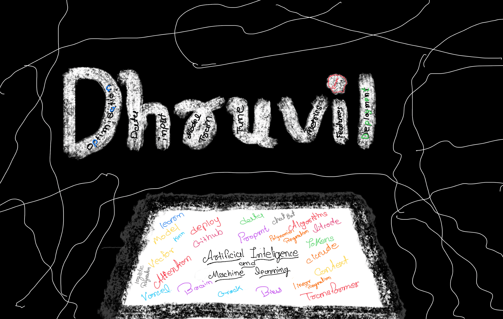

  

<h2>⚡ ABOUT ME</h2>

<table>
<tr>
<td width="60%" valign="top">

<h3>👨‍💻 Who Am I?</h3>

<samp>
Artificial Intelligence And Machine Learning Student | Passionate About Machine Learning, Web Development
</samp>

  

<b>🧠 Interests</b>

  

<samp>
• Artificial Intelligence & Machine Learning 
• Deep Learning & Generative AI 
• Computer Vision 
• RAG & Large Language Models 
• Full-Stack Development
</samp>

</td>

<td width="40%" align="center">

</td>
</tr>
</table>

  

  

<h3 align="left">Connect with me:</h3>

<h3 align="left">Languages and Tools:</h3>

              

&nbsp;

